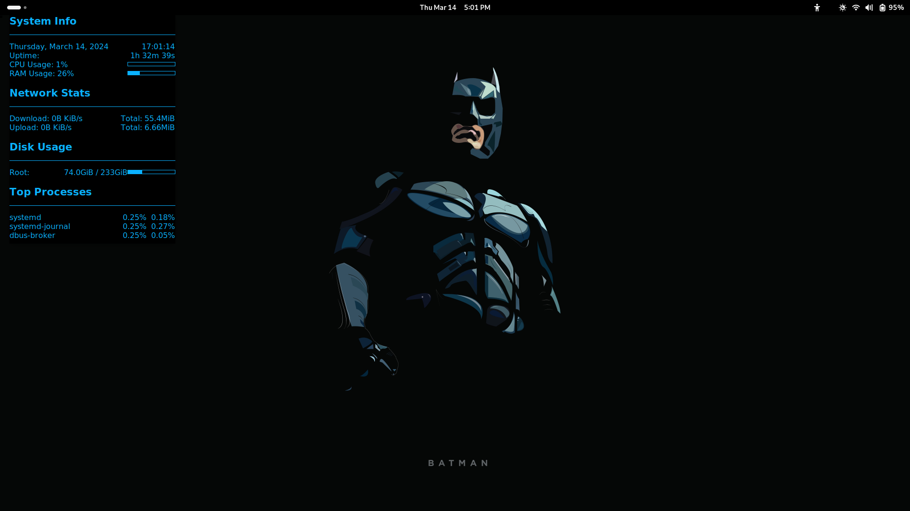

# Technical Dashboard

This repository contains a Conky configuration file that creates a technical mastery dashboard. It provides real-time system information and stats in a sleek and professional manner. I have done this on my Arch Linux.

## Features

- Display of system information such as uptime, CPU usage, RAM usage, network stats, disk usage, and top processes.
- Customized layout and styling for improved readability and visual appeal.
- Conveys a sense of technical prowess and coolness.

## Usage

1. Ensure Conky is installed on your system.
2. Clone this repository to your local machine.
3. Copy the `conky.conf` file to your Conky configuration directory (usually `~/.config/conky/`).
4. Restart Conky or reload the configuration to see the changes.

## Configuration

- Customize the `conky.conf` file to suit your preferences by adjusting colors, fonts, layout, etc.
- Refer to the Conky documentation for advanced configuration options.

## Example

## License

This project is licensed under the [MIT License](LICENSE).
